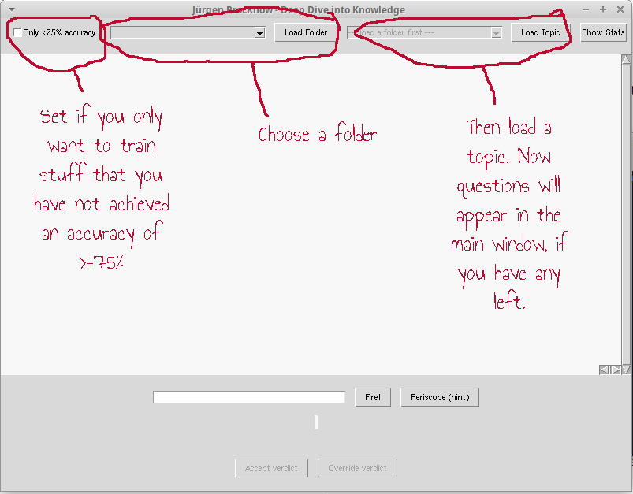
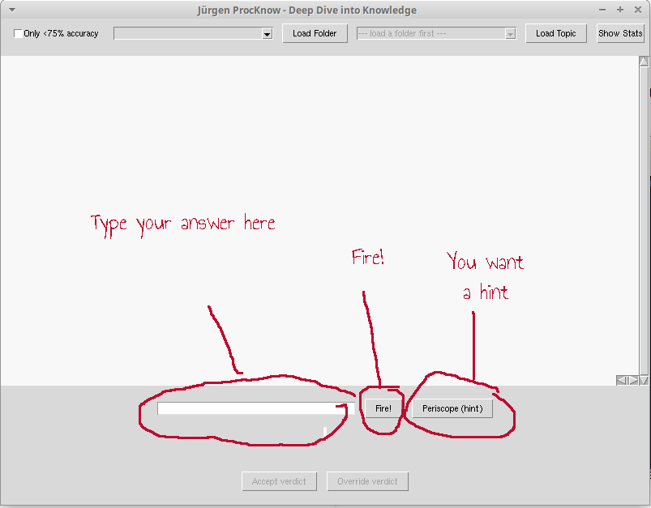
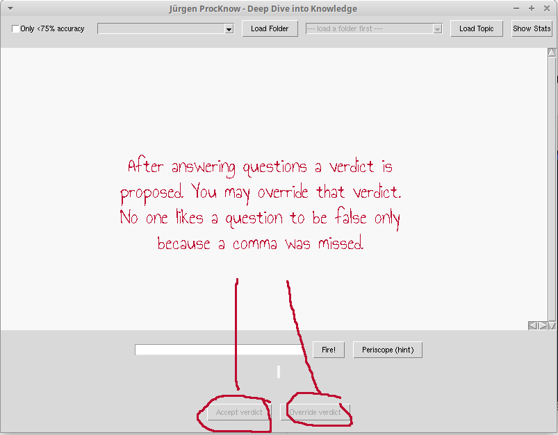
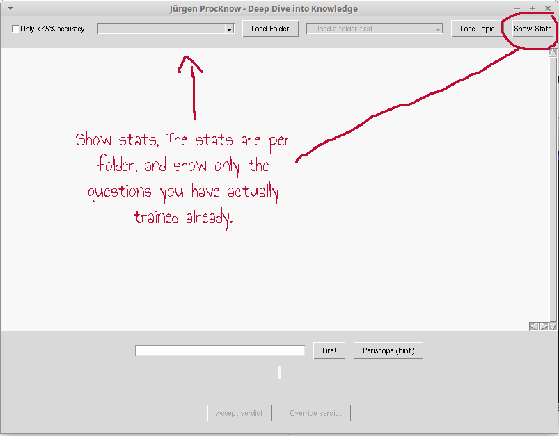

# Jürgen ProcKnow - Procedural Knowledge Trainer

## What Is This?

If you learn best by _doing_, and especially by _repeating what you do until it becomes automatic_, this might interest you.

This tool lets you train **procedural knowledge** in any domain you can express as Python functions:

* mathematics (from definitions to nontrivial steps)
* programming languages
* tool usage
* foreign languages
* workflows
* behaviors
* anything you can generate with code

If classical flashcards don’t work for you because they don’t _do_ anything, this might be more your style.

You need at least basic comfort with Python.\
You also need to understand that running arbitrary Python code on your machine is dangerous.\
This tool does zero sandboxing.\
It executes whatever functions you put into it.

If that sentence makes you uneasy, stop here.\
If that sentence makes you grin, welcome.

## How Does It work?

Clone or download the repository.\
Run:\
`python main.py`
This launches a simple GUI that handles:

* loading question sets
* presenting questions
* accepting your answers
* giving feedback
* tracking your statistics
* showing what you consistently get wrong

The screenshots below explain each button directly in the image.

### Loading Questions

### Answering Questions

### Evaluating Answers

### Looking at Stats

For each card you see:

* correct count
* wrong count
* accuracy
* recent wrong attempts (click to inspect)

This is extremely useful to see exactly where you are shaky. You can sort by each topic.

### How To Create Questions
You create them as Python functions returning dictionaries.\
Here is a minimal, fully working example:

    import random
    
    # --- 1. Integer equality test with LaTeX and hint ---
    def addition_commutativity():
        """Simple integer test with LaTeX and hint."""
        a, b = random.randint(1, 9), random.randint(1, 9)
        return {
            "name": f"add_comm_{a}_{b}",
            "question": f"Compute $ {a} + {b} $ and $ {b} + {a} $. Are they equal?",
            "data_type": "string",
            "answer": "yes",
            "comparison": "exact",
            "hint": "Addition is commutative: order does not change the result."
        }
    
    
    # --- 2. Integer computation without hint ---
    def subtraction_simple():
        a, b = random.randint(5, 15), random.randint(1, 4)
        return {
            "name": f"sub_{a}_{b}",
            "question": f"What is $ {a} - {b} $? (integer answer)",
            "data_type": "int",
            "answer": a - b,
            "comparison": "exact"
        }

Each function must return a dict with at least:

* `name`
* `question`
* `data_type` (see below)
* `answer`
* `comparison` (see below)

Optional keys include:

* `hint`
* `repeat` (to force consecutive repetitions of tricky cards)

The system then handles loading, randomization, UI, and tracking for you.
You can use some Latex in the question and the hint. It will be displayed as an image.

Jürgen ProcKnow currently supports three types of answer checking:

1. data_type="int"
   - Your answer is converted with int(...).
   - Must match exactly.

2. data_type="float" with comparison="tol=<number>"
   - Your answer is parsed as float.
   - It is accepted if |user - answer| <= tol.

3. All other data types (including strings)
   - Answers are compared after lowercasing and removing all whitespace.
   - This includes the default mode for strings.
   - "comparison" is ignored for non-float and non-int answers.

Example:
- "Hello World" matches " helloworld ".
- "Yes" matches " Y e  s  ".

In any case, as mentioned above, if your answer is incorrect because of a comparison problem, you can switch it to correct manually.

### Where To Put The Question-Scripts
Inside the `learn/` directory in a subfolder:

    learn/
        number_theory/
            chapter1.py
            chapter2.py
        statistics/
            paired_t_test.py
            independent_t_tests.py

The folder structure becomes the structure of the UI.\
Check out the folder `demo`.

### What To Learn With Jürgen ProcKnow
The limit of what you can do is your creativity and Python functions.
Some ideas:
- generate random data to learn to use external statistical or machine learning tools or languages like R
- generate scenarios, to train yourself to say “no” when you mean “no”, without impacting your personal relationships
- generate prompts for LLMs to train you in something. A language, a behavior, a habit. For instance, train to ask a lot of questions on a scenario generated by the LLM and let it rate you and get feedback on what you missed.
- generate random non trivial math exercises, or train to expand definitions
### What Not To Do

Don’t ever run someone else’s training scripts unless you have manually audited **every function**.

Each question is literally executable Python code.

There is no sandbox.\
There is no isolation.\
If someone puts `shutil.rmtree("/")` into a question, the app will happily run it.

This is a tool for people who understand the implications of running untrusted Python code on their machine.\
If that’s not you, **don’t use it with someone else’s questions.**
### Final Notes

This project is intentionally minimal:

* no network access
* no server
* no telemetry
* no hidden state
* everything is transparent Python

The goal is to provide a **simple, powerful way to build procedural fluency** in any domain you choose.

Enjoy learning.

### License
All code is licensed under MIT license.